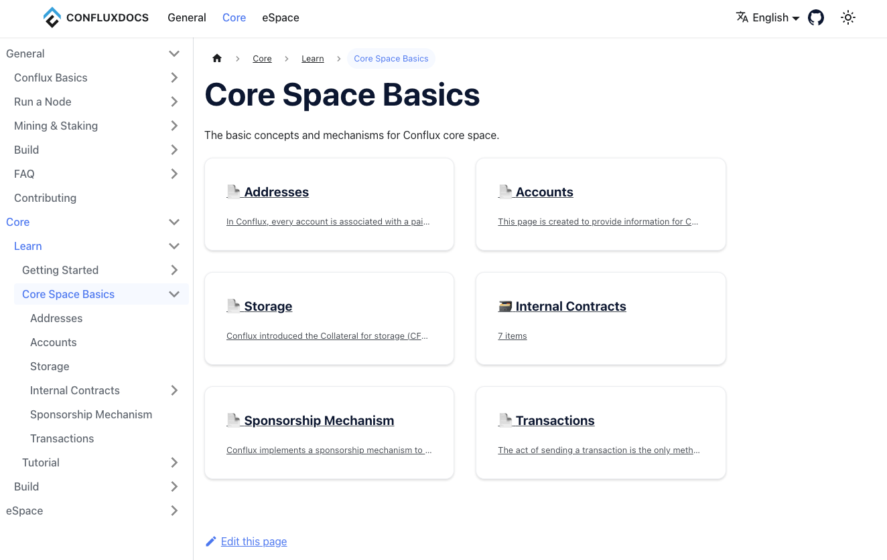

# 文档网站已焕然一新

为了提供更好的用户体验和信息准确性，我们对文档网站进行了全面改进。现在，我们诚挚邀请您加入我们的行列，共同完善这个知识库，还有机会获得 POAP 奖励！

## 文档网站的全新改版

为了让您更轻松地找到所需信息，我们调整了整体文档结构，新增了部分页面。同时，我们修复了过时的内容、优化了部分页面的写作，并对部分页面进行了彻底重写。新版文档网站被划分为三大块：

- General：Conflux 共通知识的相关文档，包括
  - 基本概念的相关文档，如区块链术语解释、Conflux 共识、经济模型等。
  - 节点运行指南，介绍如何运行节点。
  - Mining & Staking，介绍如何参与网络，从PoW/PoS中获取收益。
  - Build，节点开发者的有关文档。
  - FAQ，常见问题的索引。
  - Contributing，如何为文档贡献内容，以及向贡献者发放POAP的原则。
- Core: Conflux Core Space 的相关文档，包括
  - Learn：包括 Core 特有概念的介绍（如CIP-37地址、赞助、内置合约）以及 Core Space 使用的相关指南。
  - Build：Core Space 相关开发工具、服务与API文档。
- eSpace: Conflux eSpace的相关文档，包括
  - Learn：包括 eSpace 相关概念与使用指南。
  - Build：eSpace 相关开发工具、服务与API文档。

目前网站还有诸多不足之处，但我们将持续改进，力求为您提供更完善的知识库。也欢迎您在文档仓库中提交issue或PR为我们的网站提供意见或建议。

## 多语言翻译支持

为了让全球各地的用户都能轻松获取所需信息，我们的文档网站集成了翻译服务[Crowdin](https://zh.crowdin.com/project/conflux)。现在任何人都能在Crowdin中提交各个语种的翻译。

为了保证翻译质量，我们当前没有使用机器翻译对内容进行预翻译。目前网站的中文翻译工作正在推进中，也欢迎您为我们的文档网站贡献翻译，这将有助于让更多的人受益于我们的项目。

## POAP 激励计划

为了鼓励大家参与到文档建设中来，我们推出了 POAP 激励计划。每个季度，我们都会发行一批 POAP，以奖励为文档网站做出贡献的朋友们。在当前季度，我们设立了较为宽松的POAP发放规则，以任何形式作出任何贡献的贡献者都将能能够获得POAP，包括：

1. 指出（内容上的）错误/笔误，并（可选的）给出解决方案
2. 提供翻译
3. 添加或改进配图、表格或其他可视化内容
4. 对文档组织结构的建议
5. 编写或更新教程/指南
6. 添加/更新代码示例
7. 提高文档撰写的质量

具有突出贡献的参与者还有机会获得特殊 POAP 奖励。更多关于如何参与和奖励规则的信息，请参阅：https://doc.confluxnetwork.org/zh-CN/docs/general/CONTRIBUTING。

## 诚挚邀请您的参与

我们深知文档网站还存在许多不足之处，因此，我们非常欢迎您提出宝贵意见和建议。让我们携手共建，打造更优质、更完善的知识库！

在这个过程中，您的每一次参与都将成为社区共建的宝贵财富。感谢您对我们的支持，期待您的加入！
